## Panoramica

Utilizzando Arduino PLC IDE è possibile programmare Finder Opta utilizzando
una combinazione di C++ e Ladder, unendo la potenza e la flessibilità del
linguaggio C++ con l'approccio visuale e intuitivo del linguaggio Ladder.
Infatti, PLC IDE permette di combinare uno sketch per board Arduino con
supporto completo a tutte le librerie, ad una logica di controllo Ladder
tradizionale, fatta di contatti e bobine. Combinare Ladder con C++ offre un
vantaggio significativo per i programmatori PLC che sono familiari con la
logica Ladder ma desiderano sfruttare le potenzialità di Finder Opta a pieno
utilizzando il linguaggio C++. Questo approccio favorisce il riuso del codice
Ladder esistente e permette di integrarlo - ad esempio - con web server che
permetta di controllare il programma tramite una chiamata HTTP da remoto,
favorendo l'interoperabilità e l'espansione di sistemi già esistenti.

In questo tutorial mostreremo come programmare Finder Opta con Arduino PLC
IDE al fine di scrivere un programma Ladder controllabile da remoto tramite un
semplice web server scritto in C++. Al termine del tutorial, Finder Opta
eseguirà sia il server che la logica Ladder, permettendoci di controllare lo
stato dei LED del dispositivo tramite una chiamata HTTP.

## Obiettivi

* Comprendere come sia possibile integrare un programma Ladder ed uno sketch in
  C++ ed i vantaggi che ne conseguono.
* Creare un programma Ladder con Arduino PLC IDE per pilotare i LED di Finder
  Opta.
* Creare uno sketch in C++ che implementi un web server capace di pilotare la
  logica ladder tramite una variabile condivisa.

## Requisiti

### Hardware

* PLC Finder Opta [con runtime
  attivo](https://docs.arduino.cc/tutorials/opta/plc-ide-setup-license/#6-license-activation-with-pre-licensed-products-opta)
  (x1).
* Cavo USB-C® (x1).
* Cavo ETH RJ45 (x1).

### Software

* Ambiente di sviluppo [Arduino PLC IDE
  1.0.6+](https://www.arduino.cc/pro/software-plc-ide).
* [Codice di esempio](./assets/OptaWebServer.zip).

### Connettività

L'unico requisito di connettività di questo tutorial è che Finder Opta sia
connesso tramite il cavo ETH RJ45 ad un dispositivo in grado di instradare
pacchetti da Finder Opta al server da cui scaricare l'aggiornamento OTA, e
viceversa.

Per questo tutorial, è sufficiente che Finder Opta sia connesso tramite il cavo
ETH RJ45 ad un computer con un indirizzo IP appartenente alla stessa rete
locale a cui assegneremo Finder Opta.

## Integrazione tra PLC IDE e sketch Arduino

Arduino PLC IDE è un ambiente di sviluppo per programmare dispositivi basati su
board Arduino come PLC. Finder Opta è basato sulla board Arduino Portenta H7
e può quindi essere programmato con questa IDE utilizzando un linguaggio PLC
come il Ladder.

In aggiunta, PLC IDE offre la possibilità di integrare uno sketch Arduino
tradizionale ad un programma in Ladder, permettendo di sfruttare a pieno le
potenzialità di Finder Opta. Infatti, è possibile fare interagire un programma
Ladder ed uno sketch tramite un set di variabili condivise in ingresso o
uscita. Tramite questo approccio possiamo quindi scrivere una solida e
intuitiva logica Ladder da fare interagire con funzionalità avanzate,
sfruttando tutta la potenza e la versatilità del C++.

## Finder Opta e i protocolli Ethernet e HTTP

Grazie alla libreria `Ethernet`, Finder Opta può avviare un server in ascolto
su una specifica porta. Questo significa che il dispositivo rimarrà in attesa
di connessioni da parte di un client, per riceverne le richieste. Una volta
ricevute, Finder Opta può utilizzare la libreria `ArduinoHttpClient` per
interpretarne il contenuto.

## Istruzioni

### Creare un progetto su PLC IDE

Per seguire questo tutorial, sarà necessaria [l'ultima versione di Arduino PLC
IDE](https://www.arduino.cc/pro/software-plc-ide). Come prima cosa, apriremo
PLC IDE e creeremo un nuovo progetto chiamato `OptaWebServer`.

In seguito inizializzeremo manualmente Finder Opta, utilizzando il numero di
porta più alto tra quelli disponibili:

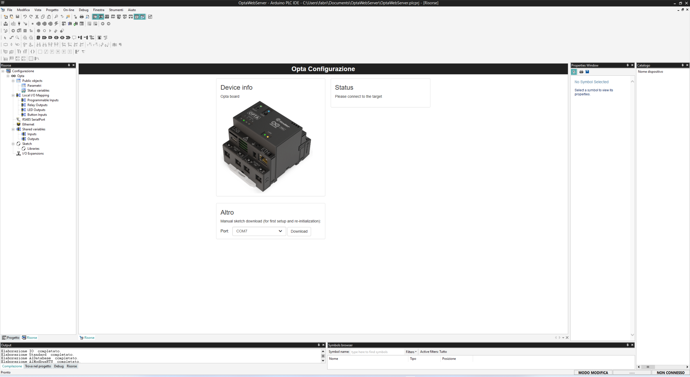

Configuriamo i parametri della connessione tra PLC IDE e Finder Opta cliccando
su *Online > Imposta Comunicazione > Proprietà*::

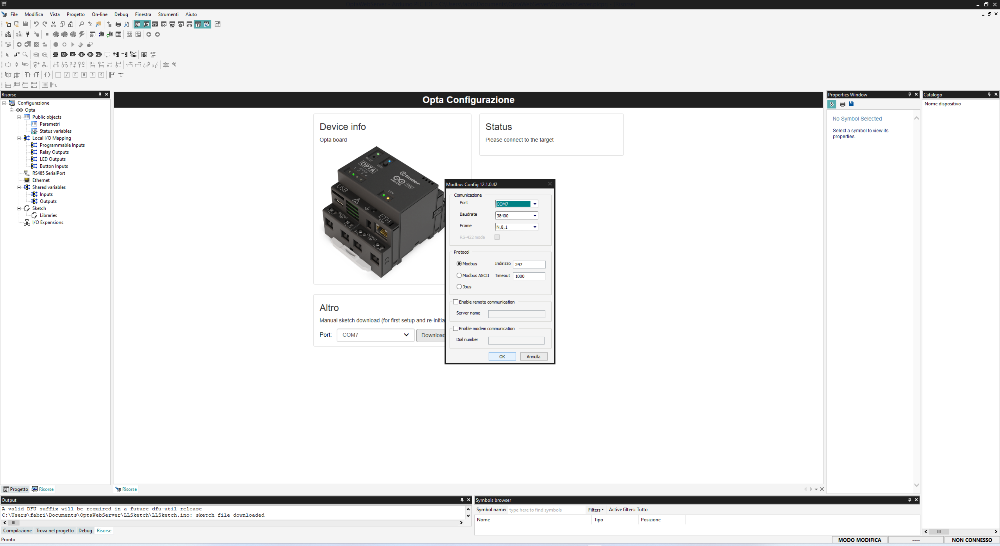

Anche in questo caso è importante verificare che la porta selezionata sia
quella con numero più alto. A questo punto possiamo connetterci al dispositivo
cliccando sul bottone *Online > Connetti*. La schermata di PLC IDE mostrerà che
il dispositivo è correttamente connesso:

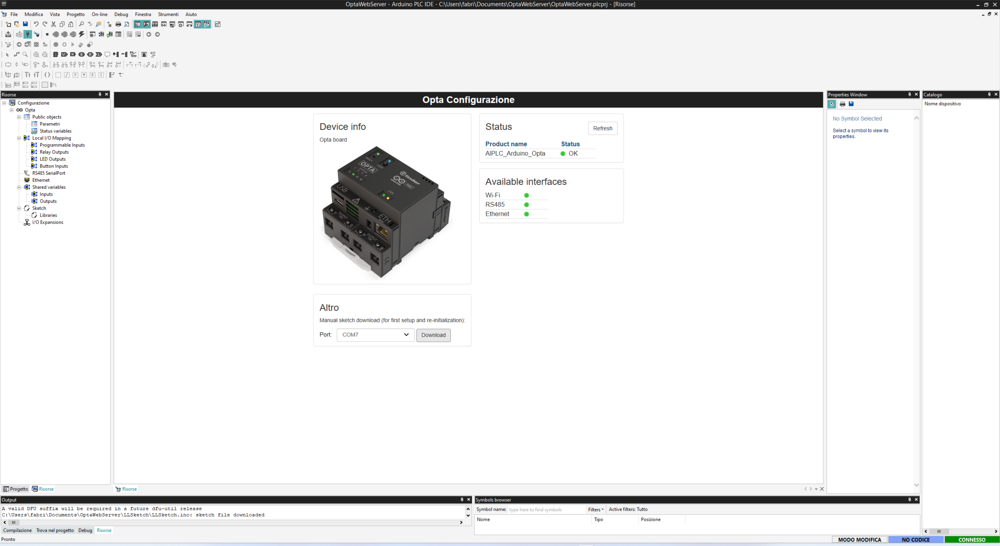

### Il programma Ladder

Il nostro programma Ladder dovrà svolgere un compito molto semplice: pilotare i
LED di Finder Opta a seconda del valore contenuto in una variabile condivisa
con lo sketch. Per far ciò avremo bisogno di:

* Quattro variabili locali mappate ai LED di Finder Opta, chiamate `led1`,
  `led2`, `led3` e `led4`.
* Una variabile condivisa tra il programma Ladder e lo sketch, chiamata
  `in_PinValue`.

Per creare le variabili locali clicchiamo su *Resources > Local I/O mapping >
LED outputs*:

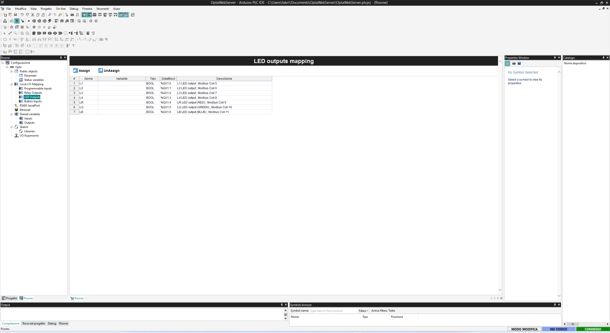

A questo punto inseriamo nella colonna *Variabile* il nome di ciascuna
variabile:

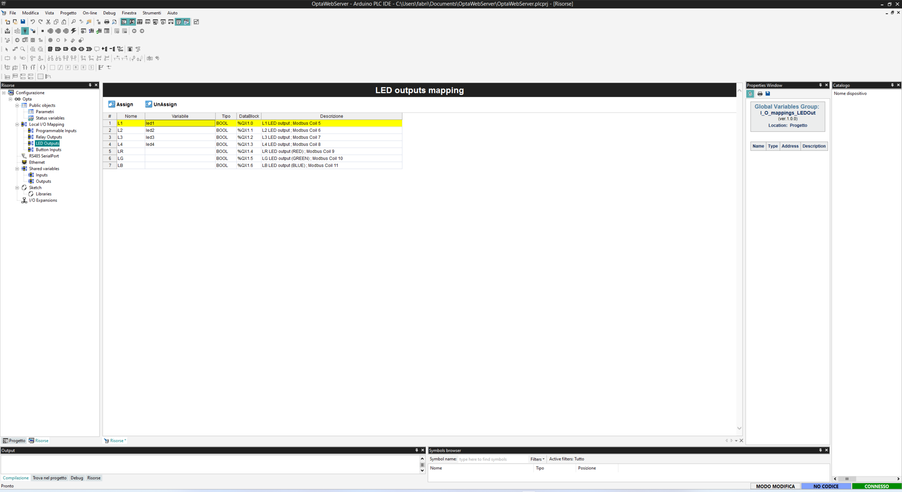

Per creare la variabile condivisa clicchiamo su *Resources > Shared variables >
Inputs* e creiamo una nuova variabile `in_PinValue` di tipo `BOOL`:

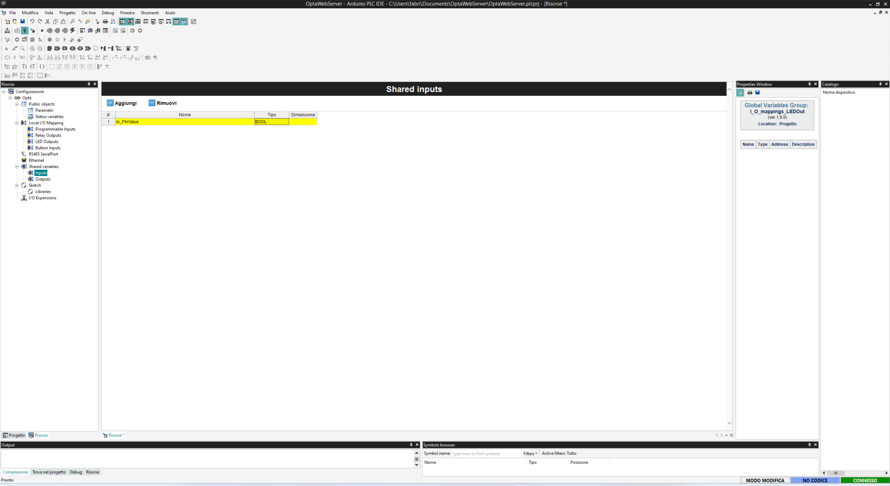

Ora creiamo il corpo del nostro programma Ladder, cliccando sul tasto
*Progetto*. Da questa schermata eliminiamo il file `main` creato
automaticamente dall'IDE, ed in seguito clicchiamo con il tasto destro sul
progetto ed aggiungiamo un nuovo programma Ladder, come mostrato in figura:

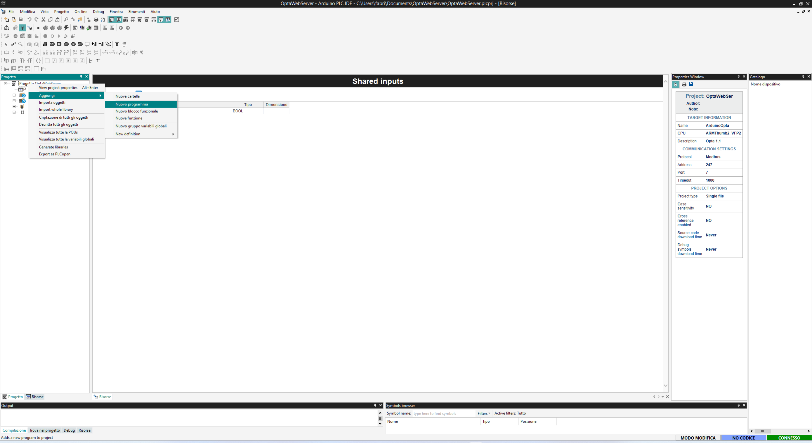

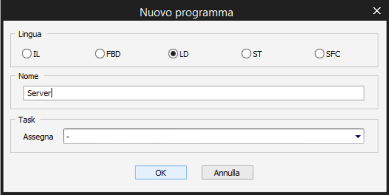

Nel nostro programma facciamo click con il tasto destro sulla bobina e
clicchiamo sul bottone *Bobina*, per aggiungerne altre quattro, una per ciascun
LED di Finder Opta:

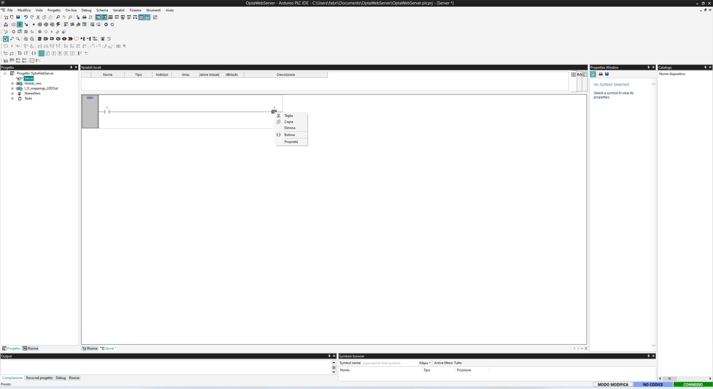

In seguito facciamo doppio click su ciascuna bobina per
assegnare ad ognuna la variabile mappata al LED, come mostrato in figura:

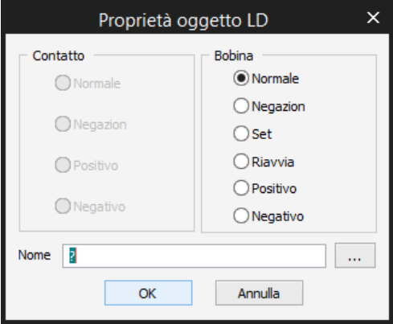

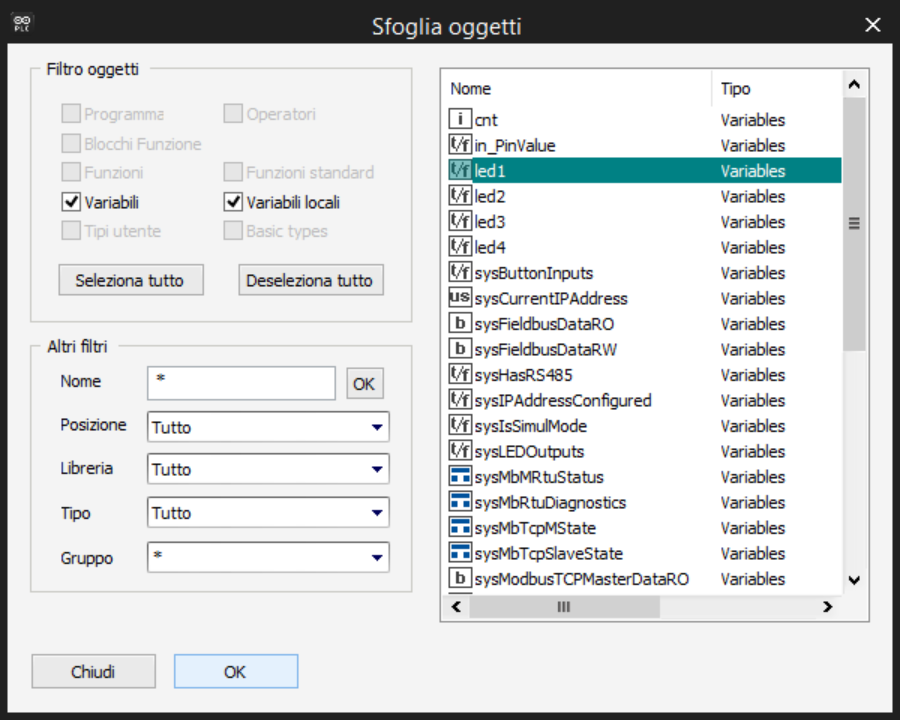

A questo punto facciamo doppio click sul contatto e gli assegniamo la variabile
condivisa `in_PinValue`. Al termine di queste operazioni il programma Ladder
avrà il seguente aspetto:

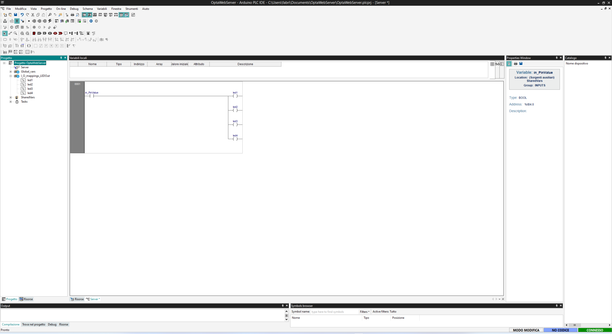

Ci troviamo quindi di fronte ad un diagramma a contatti in cui quattro bobine,
ovvero i LED di Finder Opta, vengono controllate da un singolo contatto, ovvero
la variabile condivisa tra il programma Ladder e lo sketch scritto in C++.
Ovviamente sarà proprio lo sketch contenente il web server ad impostare il
valore di questa variabile ogni volta che riceve una richiesta HTTP. Per
concludere il nostro programma Ladder non ci resta che registrarlo come task:
clicchiamo con il tasto destro su *Task > Fast*, poi *Aggiungi programma* e
selezioniamo il nostro programma Ladder.

### Lo sketch che implementa il web server

Torniamo ora alla schermata *Risorse* ed aggiungiamo le librerie necessarie ad
implementare un semplice web server su Finder Opta. Clicchiamo sul bottone
*Sketch > Libraries* ed aggiungiamo le due librerie mostrate in figura:

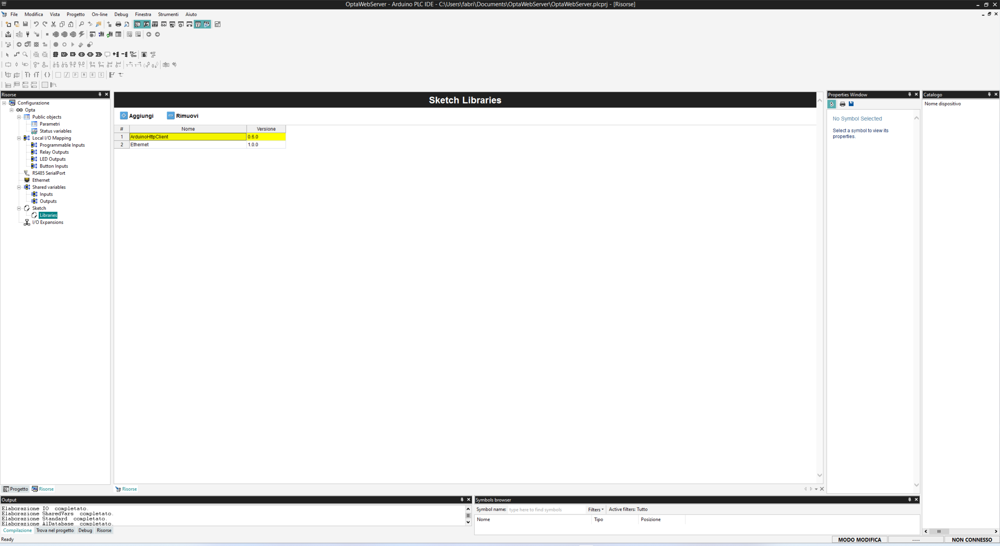

In seguito clicchiamo sul bottone *Sketch* ed iniziamo a scrivere il programm
che si occuperà di:

* Avviare un web server su Finder Opta ad un certo indirizzo IP e su una certa
  porta.
* Accettare richieste HTTP dai client.
* In caso di richiesta GET al path `"/led"`, cambiare lo stato dei LED di
  Finder Opta per mezzo del programma Ladder scritto in precedenza.

Come tutti gli sketch per Arduino, il nostro programma sarà composto da una
funzione `setup()` e una funzione `loop()`:

```cpp
void setup() {
  // Codice di setup, eseguito all'avvio
}

void loop() {
  // Codice di loop, eseguito all'infinito
}
```

All'inizio del nostro sketch andremo ad importare le librerie necessarie al
funzionamento del programma:

```cpp
#include <Arduino.h>
#include <Portenta_Ethernet.h>
#include <EthernetServer.h>
#include <EthernetClient.h>
#include <ArduinoHttpClient.h>

void setup() {
  // Codice di setup, eseguito all'avvio
}

void loop() {
  // Codice di loop, eseguito all'infinito
}
```

In particolare abbiamo importato le librerie:

* `Arduino`: contiene numerose funzionalità di base per le schede Arduino, ed è
  quindi buona norma importarla all'inizio di tutti gli sketch.
* `Portenta_Ethernet`: permette di stabilire la connettività Ethernet.
* `EthernetServer`: permette di creare un server in ascolto.
* `EthernetClient`: permette di creare un client per gestirne la connessione.
* `ArduinoHttpClient`: permette di interagire con richieste HTTP in maniera
  semplice.

A questo punto definiamo due costanti per identificare path e metodo delle
richieste HTTP, e due costanti che determinano la lunghezza massimo permessa
per path e metodo all'interno delle richieste:

```cpp
#include <Arduino.h>
#include <Portenta_Ethernet.h>
#include <EthernetServer.h>
#include <EthernetClient.h>
#include <ArduinoHttpClient.h>

#define LED_PATH "/led"
#define HTTP_GET "GET"
#define MAX_PATH_LEN 2048
#define MAX_METHOD_LEN 16

void setup() {
  // Codice di setup, eseguito all'avvio
}

void loop() {
  // Codice di loop, eseguito all'infinito
}
```

Procediamo definendo indirizzo IP statico e porta del web server, ed
inizializzando una variabile booleana che utilizzeremo per accendere e spegnere
i LED:

```cpp
#include <Arduino.h>
#include <Portenta_Ethernet.h>
#include <EthernetServer.h>
#include <EthernetClient.h>
#include <ArduinoHttpClient.h>

#define LED_PATH "/led"
#define HTTP_GET "GET"
#define MAX_PATH_LEN 2048
#define MAX_METHOD_LEN 16

// Indirizzo IP e porta del server
IPAddress ip(192, 168, 10, 15);
int port = 80;
EthernetServer server(port);

// Valore iniziale dei LED
bool pinVal = true;

void setup() {
  // Codice di setup, eseguito all'avvio
}

void loop() {
  // Codice di loop, eseguito all'infinito
}
```

A questo punto abbiamo tutto il necessario per scrivere la funzione `setup()`,
eseguita una singola volta all'avvio di Finder Opta. Nel nostro caso all'avvio
del programma assegneremo l'indirizzo IP al web server, che poi avvieremo:

```cpp
#include <Arduino.h>
#include <Portenta_Ethernet.h>
#include <EthernetServer.h>
#include <EthernetClient.h>
#include <ArduinoHttpClient.h>

#define LED_PATH "/led"
#define HTTP_GET "GET"
#define MAX_PATH_LEN 2048
#define MAX_METHOD_LEN 16

// Indirizzo IP e porta del server
IPAddress ip(192, 168, 10, 15);
int port = 80;
EthernetServer server(port);

// Valore iniziale dei LED
bool pinVal = true;

void setup() {
  // Assegna indirizzo IP e avvia server
  Ethernet.begin(ip);
  server.begin();
}

void loop() {
  // Codice di loop, eseguito all'infinito
}
```

Terminato il codice di `setup()`, passiamo alla funzione di `loop()`. Questa
funzione attenderà che i client si connettano, e procederà poi interpretando la
richiesta ricevuta. Una volta terminate queste operazioni in client verrà
disconnesso:

```cpp
#include <Arduino.h>
#include <Portenta_Ethernet.h>
#include <EthernetServer.h>
#include <EthernetClient.h>
#include <ArduinoHttpClient.h>

#define LED_PATH "/led"
#define HTTP_GET "GET"
#define MAX_PATH_LEN 2048
#define MAX_METHOD_LEN 16

// Indirizzo IP e porta del server
IPAddress ip(192, 168, 10, 15);
int port = 80;
EthernetServer server(port);

// Valore iniziale dei LED
bool pinVal = true;

void setup() {
  // Assegna indirizzo IP e avvia server
  Ethernet.begin(ip);
  server.begin();
}

void loop() {
  EthernetClient client = server.available();
  if (client) {
    HttpClient http = HttpClient(client, ip, port);
    while (client.connected()) {
      // Interpreta la richiesta HTTP ricevuta

      // Disconnessione del client una volta processata la richiesta
      break;
    }
    client.stop();
  }
}
```

Per interpretare la richiesta ricevuta dovremo leggerne i byte come stringhe
NULL-terminated. Scriviamo quindi una funzione per ottenere metodo e path di
una richiesta HTTP:

```cpp
#include <Arduino.h>
#include <Portenta_Ethernet.h>
#include <EthernetServer.h>
#include <EthernetClient.h>
#include <ArduinoHttpClient.h>

#define LED_PATH "/led"
#define HTTP_GET "GET"
#define MAX_PATH_LEN 2048
#define MAX_METHOD_LEN 16

// Indirizzo IP e porta del server
IPAddress ip(192, 168, 10, 15);
int port = 80;
EthernetServer server(port);

// Valore iniziale dei LED
bool pinVal = true;

void setup() {
  // Assegna indirizzo IP e avvia server
  Ethernet.begin(ip);
  server.begin();
}

void loop() {
  EthernetClient client = server.available();
  if (client) {
    HttpClient http = HttpClient(client, ip, port);
    while (client.connected()) {
      char method[MAX_METHOD_LEN], path[MAX_PATH_LEN];
      getHttpMethodAndPath(&http, method, path);
      // Interpreta la richiesta HTTP ricevuta

      // Disconnessione del client una volta processata la richiesta
      break;
    }
    client.stop();
  }
}

void getHttpMethodAndPath(HttpClient *http, char *method, char *path) {
  size_t l = http->readBytesUntil(' ', method, MAX_METHOD_LEN - 1);
  method[l] = '\0';
  l = http->readBytesUntil(' ', path, MAX_PATH_LEN - 1);
  path[l] = '\0';
}
```

A questo punto possiamo verificare che il path e il metodo della richiesta
siano quelli attesi, restituendo dei codici di errore HTTP in caso negativo:

```cpp
#include <Arduino.h>
#include <Portenta_Ethernet.h>
#include <EthernetServer.h>
#include <EthernetClient.h>
#include <ArduinoHttpClient.h>

#define LED_PATH "/led"
#define HTTP_GET "GET"
#define MAX_PATH_LEN 2048
#define MAX_METHOD_LEN 16

// Indirizzo IP e porta del server
IPAddress ip(192, 168, 10, 15);
int port = 80;
EthernetServer server(port);

// Valore iniziale dei LED
bool pinVal = true;

void setup() {
  // Assegna indirizzo IP e avvia server
  Ethernet.begin(ip);
  server.begin();
}

void loop() {
  EthernetClient client = server.available();
  if (client) {
    HttpClient http = HttpClient(client, ip, port);
    while (client.connected()) {
      char method[MAX_METHOD_LEN], path[MAX_PATH_LEN];
      getHttpMethodAndPath(&http, method, path);
      // Se il path è "/led"
      if (strncmp(path, LED_PATH, MAX_PATH_LEN) == 0) {
        // Se il metodo è GET
        if (strncmp(method, HTTP_GET, MAX_METHOD_LEN) == 0) {
           // Cambia stato dei LED!
        } else {
          badRequest(&client);
        }
      } else {
        notFound(&client);
      }
      // Disconnessione del client una volta processata la richiesta
      break;
    }
    client.stop();
  }
}

void getHttpMethodAndPath(HttpClient *http, char *method, char *path) {
  size_t l = http->readBytesUntil(' ', method, MAX_METHOD_LEN - 1);
  method[l] = '\0';
  l = http->readBytesUntil(' ', path, MAX_PATH_LEN - 1);
  path[l] = '\0';
}

void notFound(EthernetClient *client) {
  client->println("HTTP/1.1 404 Not Found");
  client->println("Connection: close");
  client->println("Content-Length: 0");
  client->println();
}

void badRequest(EthernetClient *client) {
  client->println("HTTP/1.1 400 Bad Request");
  client->println("Connection: close");
  client->println("Content-Length: 0");
  client->println();
}
```

In caso affermativo, non ci resta invece che utilizzare la nostra variabile
`pinVal` per impostare il contenuto della variabile condivisa con il programma
Ladder. Possiamo accedere alla variabile ladder `in_PinValue` dallo sketch C++
utilizzando la notazione `PLCIn.in_PinValue`. Inoltre la funzione dovrà
invertire il valore di `pinVal` per far cambiare lo stato dei LED in caso di
chiamate HTTP successive:

```cpp
#include <Portenta_Ethernet.h>
#include <EthernetServer.h>
#include <EthernetClient.h>
#include <ArduinoHttpClient.h>

#define LED_PATH "/led"
#define HTTP_GET "GET"
#define MAX_PATH_LEN 2048
#define MAX_METHOD_LEN 16

// Indirizzo IP e porta del server
IPAddress ip(192, 168, 10, 15);
int port = 80;
EthernetServer server(port);

// Valore iniziale dei LED
bool pinVal = true;

void setup() {
  // Assegna indirizzo IP e avvia server
  Ethernet.begin(ip);
  server.begin();
}

void loop() {
  EthernetClient client = server.available();
  if (client) {
    HttpClient http = HttpClient(client, ip, port);
    while (client.connected()) {
      char method[MAX_METHOD_LEN], path[MAX_PATH_LEN];
      getHttpMethodAndPath(&http, method, path);
      // Se il path è "/led"
      if (strncmp(path, LED_PATH, MAX_PATH_LEN) == 0) {
        // Se il metodo è GET
        if (strncmp(method, HTTP_GET, MAX_METHOD_LEN) == 0) {
          toggleLEDs();
        } else {
          badRequest(&client);
        }
      } else {
        notFound(&client);
      }
      // Disconnessione del client una volta processata la richiesta
      break;
    }
    client.stop();
  }
}

void toggleLEDs() {
  PLCIn.in_PinValue = pinVal;
  pinVal = !pinVal;
}

void getHttpMethodAndPath(HttpClient *http, char *method, char *path) {
  size_t l = http->readBytesUntil(' ', method, MAX_METHOD_LEN - 1);
  method[l] = '\0';
  l = http->readBytesUntil(' ', path, MAX_PATH_LEN - 1);
  path[l] = '\0';
}

void notFound(EthernetClient *client) {
  client->println("HTTP/1.1 404 Not Found");
  client->println("Connection: close");
  client->println("Content-Length: 0");
  client->println();
}

void badRequest(EthernetClient *client) {
  client->println("HTTP/1.1 400 Bad Request");
  client->println("Connection: close");
  client->println("Content-Length: 0");
  client->println();
}
```

Il nostro sketch è terminato: ora non ci resta che salvare il progetto e
testare il web server.

### Caricare il codice su Finder Opta

Assicurandosi che PLC IDE sia connesso a Finder Opta, clicchiamo su *Online >
Trasferimento codice*. L'IDE inizierà a compilare il codice e procederà a
caricarlo su Finder Opta. In caso ci vengano mostrati dei prompt, sarà
sufficiente proseguire, permettendo a PLC IDE di completare le operazioni
richieste.

Possiamo ora testare il nostro programma con un semplice comando curl da
terminale:

```bash
curl http://192.168.10.15:80/led
```

Eseguendo questo comando più volte vedremo i LED del Finder Opta accendersi e
spegnersi ad ogni richiesta HTTP!

## Conclusioni

In questo tutorial abbiamo visto come utilizzare Arduino PLC IDE per
programmare Finder Opta combinando il linguaggio Ladder con il C++. Questa
combinazione ci consente di sfruttare al meglio le potenzialità del Finder
Opta, unendo la logica visuale e intuitiva del linguaggio Ladder con la potenza
e la flessibilità del C++.

Abbiamo creato un semplice programma Ladder per controllare i LED del Finder
Opta, integrandolo con uno sketch in C++ che implementa un web server. Questo
ci ha permesso di controllare il programma Ladder tramite richieste HTTP.

In conclusione, l'implementazione di un web server per Finder Opta
utilizzando Arduino PLC IDE rappresenta un ottimo esempio di come sia possibile
integrare la logica di controllo tradizionale con le tecnologie web, aprendo
nuove possibilità per il controllo e il monitoraggio remoto dei dispositivi
PLC.
